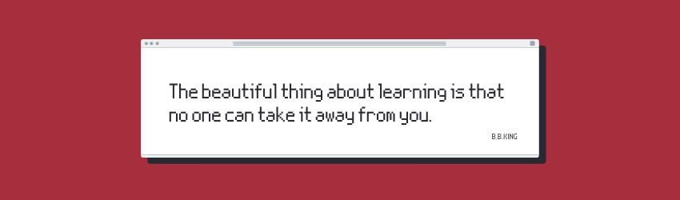

# json-parse-to-list

## About app

  

One screen application that parses JSON from a network and turns it into a list inside a table view.
JSON is hosted on https://api.myjson.com/bins/1g99i5 and contains product offers.
Offers can then be sorted by name or cashback.

 

>This is a learning project created by implementing different Swift components. Check my portfolio at [dvrzan.github.io/](https://dvrzan.github.io)

 

